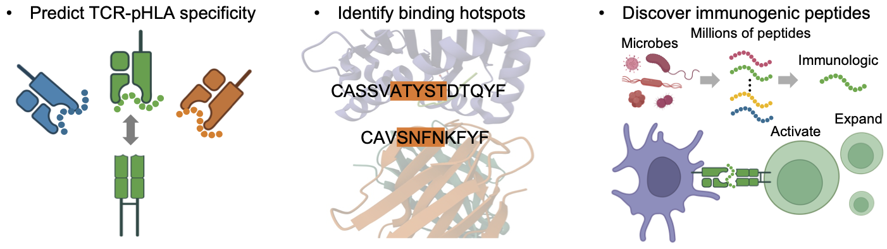

<p align="left">
  
</p>


[](https://pypi.org/project/trimap-tools/)
[](https://pepy.tech/project/trimap-tools)
[](https://trimap-tools.readthedocs.io/)

# Discovering TCR-HLA-Epitope interactions with Deep Learning

<p align="center">
  
</p>

**trimap-tools** is a package for analysis of peptide-HLA presentation and TCR specificity. It is designed to help researchers understand the interactions between T cell receptors (TCRs) and peptides presented by human leukocyte antigen (HLA) molecules, which play a crucial role in the immune response. 

## Installation
**trimap-tools** requires **Python 3.9** or later. It is available on PyPI and can be installed using pip:
```bash
pip install trimap-tools
```
or by cloning the repository and installing it manually:
```bash
pip install git+https://github.com/uhlerlab/trimap-tools.git@main
```

## Tutorials
For step-by-step guides on how to use **trimap-tools**, including training HLA/peptide encoders and predicting TCR specificity, please refer to the [Documentation](https://trimap-tools.readthedocs.io/) section.

## Key Features

- **Peptide representation learning with HLA context**  
  Learns latent embeddings of peptides while incorporating HLA background, enabling biologically informed modeling.

- **TCR specificity prediction using full receptor sequences**  
  Supports comprehensive modeling of TCR recognition by leveraging both α and β chain CDR regions.

- **Visualization of critical TCR residues**  
  Highlights key amino acid positions in TCRs that contribute to antigen recognition, aiding biological interpretation.

- **Discovery of disease-associated epitopes**  
  Identifies novel peptides potentially involved in disease by integrating small-scale disease-specific data with large-scale public datasets.

## Citation
If you use **trimap-tools** in your research, please cite the following paper: