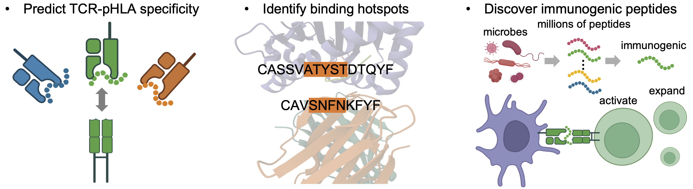

<p align="left">
  
</p>


[](https://pypi.org/project/trimap-tools/)
[](https://pepy.tech/project/trimap-tools)
[](https://trimap-tools.readthedocs.io/)

# Discovering TCR-HLA-Epitope interactions with Deep Learning

<p align="center">
  
</p>

**trimap-tools** is a package for analysis of peptide-HLA presentation and TCR specificity. It is designed to help researchers understand the interactions between T cell receptors (TCRs) and peptides presented by human leukocyte antigen (HLA) molecules, which play a crucial role in the immune response. 

## Installation
Create a conda environment. **trimap-tools** requires **Python 3.9** or later.
```bash
conda create -n trimap-env python=3.9
conda activate trimap-env
```
It is available on PyPI and can be installed using pip:
```bash
pip install trimap-tools
```
or by cloning the repository and installing it manually:
```bash
pip install git+https://github.com/uhlerlab/trimap-tools.git@main
```

## Tutorials
For step-by-step guides on how to use **trimap-tools**, including training HLA/peptide encoders and predicting TCR specificity, please refer to the [Documentation](https://trimap-tools.readthedocs.io/) section.

To predict TCR specificity for pHLA complexes, follow these steps:

+ Step 1. [Train representations for HLA sequences](https://trimap-tools.readthedocs.io/en/latest/Turtorial/HLA.html) or load our pre-trained models from [Here](https://drive.google.com/file/d/1WUSV3ZvzyReVeG0w3URtS1i7gDES_ltq/view?usp=drive_link).

+ Step 2. [Train representations for peptides in the context of HLA](https://trimap-tools.readthedocs.io/en/latest/Turtorial/pHLA.html) or load our pre-trained models from [Here](https://drive.google.com/file/d/1P4ryFUidP4NX1vnKhVF0ETu-nQ1sYBoA/view?usp=drive_link).

+ Step 3. [Predict TCR specificity for pHLA complexes](https://trimap-tools.readthedocs.io/en/latest/Turtorial/TCR.html) or load our pre-trained models from [Here](https://drive.google.com/file/d/1Ns0RGPDY2mFAqVaZ1oNKgxynmCfql0HH/view?usp=drive_link).

To train a model for discovering disease-associated epitopes, follow these steps:

+ [Integrate public and disease-specific datasets to train TriMap](https://trimap-tools.readthedocs.io/en/latest/Application/Train_model.html)

+ [Scan peptides from disease-related proteomes](https://trimap-tools.readthedocs.io/en/latest/Application/Screen_peptides.html)

+ [Apply THEmap to predict novel epitopes](https://trimap-tools.readthedocs.io/en/latest/Application/Predict_epitopes.html)

## Key Features

- **Peptide representation learning with HLA context**  
  Learns latent embeddings of peptides while incorporating HLA background, enabling biologically informed modeling.

- **TCR specificity prediction using full receptor sequences**  
  Supports comprehensive modeling of TCR recognition by leveraging both α and β chain CDR regions.

- **Visualization of critical TCR residues**  
  Highlights key amino acid positions in TCRs that contribute to antigen recognition, aiding biological interpretation.

- **Discovery of disease-associated epitopes**  
  Identifies novel peptides potentially involved in disease by integrating small-scale disease-specific data with large-scale public datasets.

## Citation
If you use **trimap-tools** in your research, please cite the following paper: